# test-hello_world_app-minikube

Тестовое задание по развертыванию веб-приложения "hello" в Minikube.

## Компоненты
- **Docker Image:** `physxcska/go-hello-app:latest`
- **Dockerhub:** `https://hub.docker.com/r/physxcska/go-hello-app`
- **Язык программирования веб-приложения:** `go`
- **Используемые образы в dockerfile:** `golang:1.27.1-alpine3.24` и `alpine:3.24`
- **Port:** `32777`

## Схема архитектуры
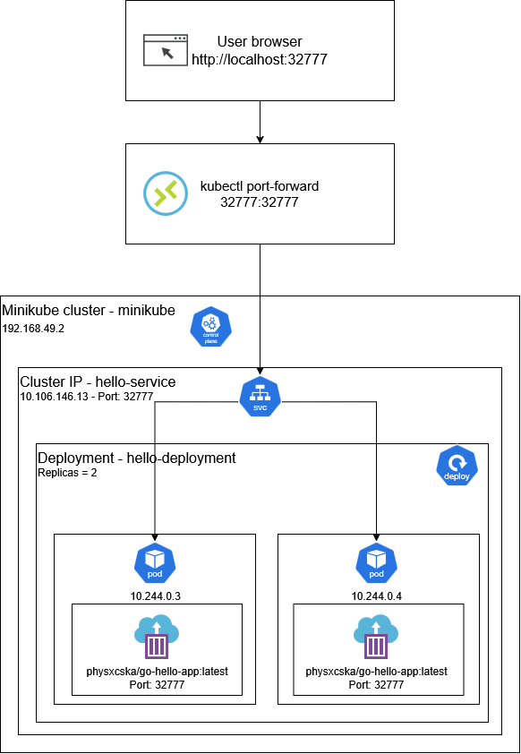

## Запуск в Minikube
```bash
git clone https://github.com/physxcska/test-hello_world_app-minikube.git
cd test-hello_world_app-minikube
kubectl apply -f minikube.yml
```
## Веб-приложение
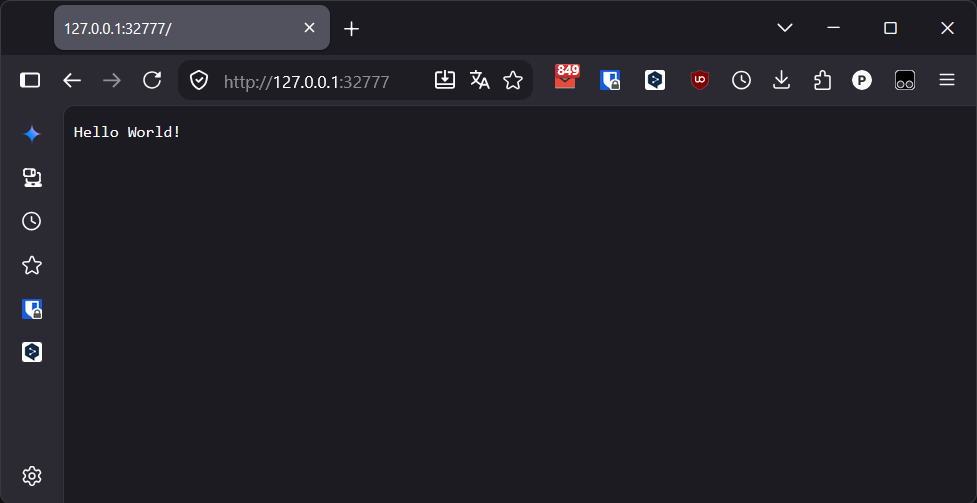
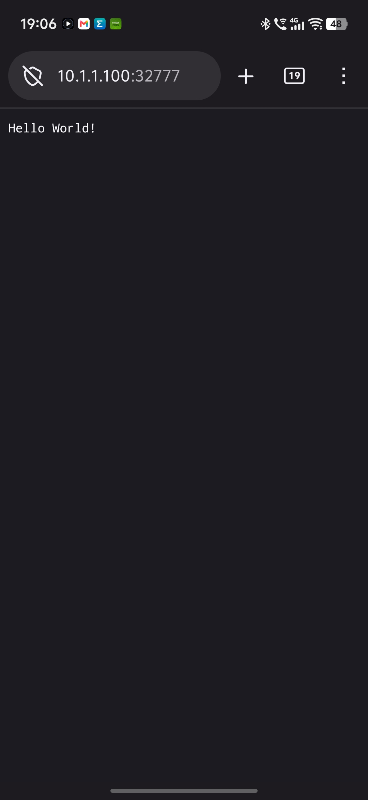

## Порядок разработки
<details>
<summary>Спойлер</summary>

**1.** создание веб-приложения "hello world" app на go  
см. файл main.go  
  
**2.** компиляция и запуск приложения на локальном хосте  
```bash
go run main.go  
```
http://localhost:32777/  
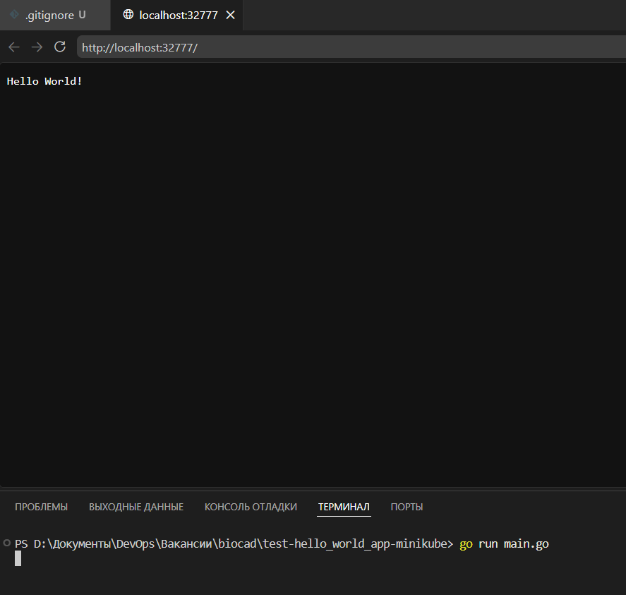  
  
**3.** создание dockerfile  
см. dockerfile  
  
**4.** связка с логином на dockerhub  
```bash
docker login  
```
  
**5.** создание образа с тэгами v1 и latest  
```bash
docker build -t physxcska/go-hello-app:v1 -t physxcska/go-hello-app:latest .  
```
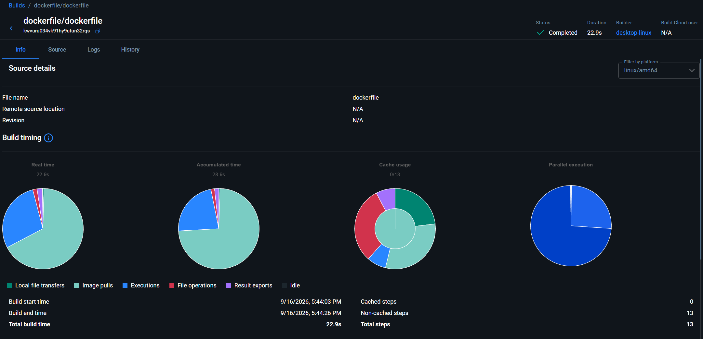  
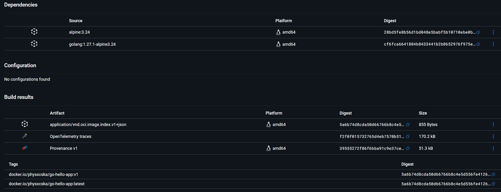  
  
**6.** проверка работы из докера локально  
```bash
docker run -p 32777:32777 -d physxcska/go-hello-app:latest  
```
http://localhost:32777/  
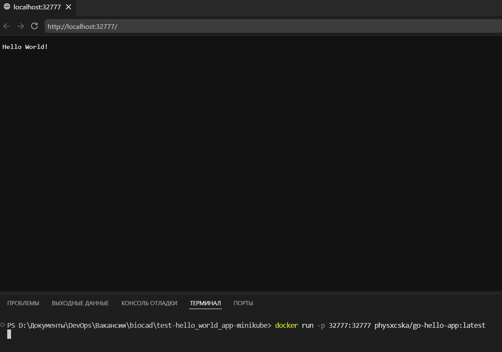  
  
**7.** выгрузка образов на dockerhub  
```bash
docker push physxcska/go-hello-app:v1  
docker push physxcska/go-hello-app:latest  
```
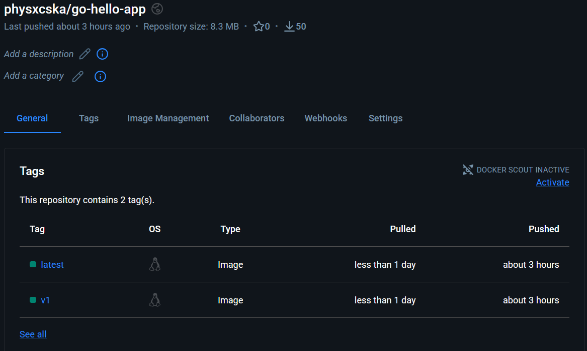  
  
**8.** установка и запуск minikube на windows x86  
https://minikube.sigs.k8s.io/docs/start/?arch=%2Fwindows%2Fx86-64%2Fstable%2F.exe+download  
```bash
minikube start  
kubectl get node  
```
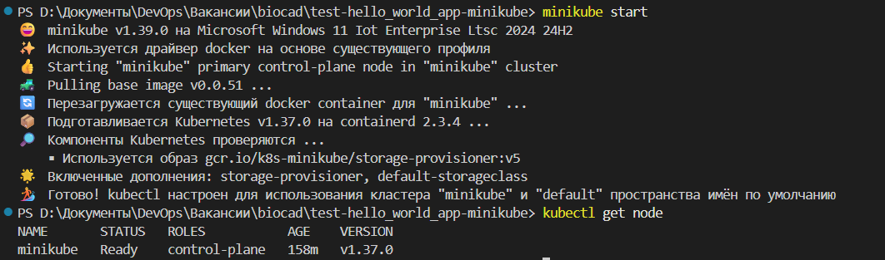  
  
**9.** создание файла манифеста minikube.yml с deploy (2 реплики) и service (cluster-ip).  
см. minikube.yml  
  
**10.** запуск файла манифеста  
```bash
kubectl apply -f .\minikube.yml  
```
проверка создания pods, deploy и service  
```bash
kubectl get pods -o wide  
kubectl get deploy -o wide  
kubectl get svc -o wide  
```
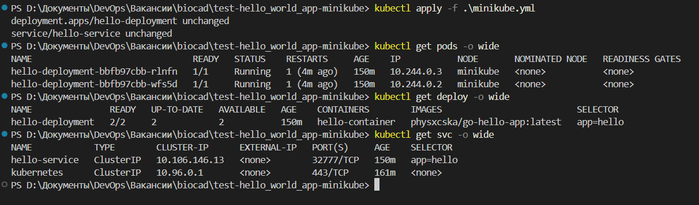  
  
**11.** проброс портов для проверки работы веб-приложения hello  
для работы только на localhost  
```bash
kubectl port-forward svc/hello-service 32777:32777  
```
для работы веб-приложения в локальной сети  
```bash
kubectl port-forward --address 0.0.0.0 svc/hello-service 32777:32777  
```
проверка в браузере  
http://127.0.0.1:32777/ (для работы только на localhost)  
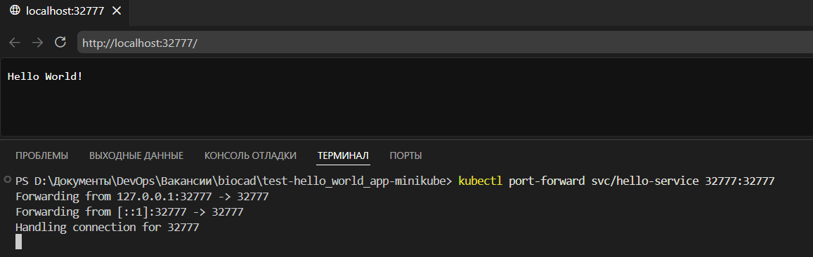  
http://host_ip:32777/ (для работы веб-приложения в локальной сети)  
  
  
**12.** создание архитектурной схемы (draw.io) и подготовка README.md  
см. раздел "Схема архитектуры"  
  
**13.** выгрузка в github репозиторий  
```bash
git init --initial-branch=main --object-format=sha1  
git remote add origin https://github.com/physxcska/test-hello_world_app-minikube.git  
git add .  
git commit -m "Initial commit"  
git push origin main  
```
</details>